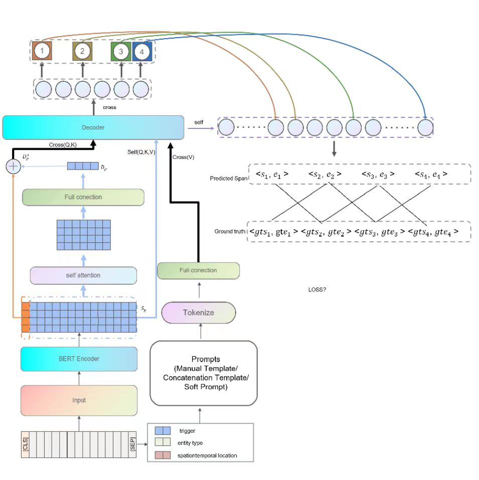

# DASP: Dynamic and Automated Static Prompts for Event Argument Extraction

This repository is the implementation of the paper 'DASP: Dynamic and Automated
Static Prompts for Event Argument Extraction', which is not published yet.

## Authors

- Xiao Xiao &emsp; Peking University &emsp; lazypool@proton.me
- Yu Han Qing The king without krown

## Overview

